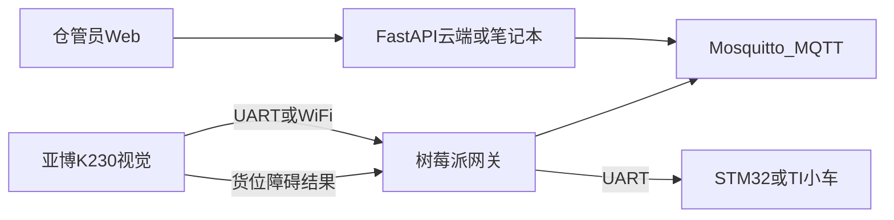

# C4 A赛项：仓储边缘感知与云边调度

## 赛项与一句话定位

- 报 **A 普通创意**，不报 A-ST / A-ICV / B-EP1
- 网络挂靠：**物联网 + 边缘计算 + 云边协同**
- 一句话：**面向小型仓储，用亚博 K230 在仓内做货位/障碍边缘识别，经树莓派 MQTT 网关调度 STM32/TI 运输小车完成拣运，Web 管理台查看画面、车态、告警并下发任务。**

教室九宫格也能讲通的痛点：人工找货、搬运、对单不同步，异常靠人眼。仓管员在网页下一次任务，小车到指定格，货位状态自动更新。

## 为什么这样切（针对你们第一次填写）

- 原想法「摄像头 + 小车 + 数据库 + AI」容易被看成智能车作业。必须把 **MQTT 总线、K230 本地识别、断云仍能跑完当前任务** 做成演示主线。
- 亚博 K230 是带算力的视觉模组（GC2093、可串口接 STM32/树莓派，板载 WiFi、可 RTSP），不是普通 USB 摄像头。视觉放在 K230 上，树莓派只做网关，符合「边缘计算」。
- 小车还没组装、树莓派可能只剩 1 台：12 周只保 **1 辆车**。第 2 辆有余力再挂上，不当里程碑。
- 小程序、机械分拣、大模型开车全部砍掉。大模型若做，只做仓管问答/周报，不进控制闭环。
- 队内至少 3 人能写代码或调硬件：五岗可以撑起来，另外的人跟测试、场地和文档。

## 系统怎么连

MQTT 主题固定为：`warehouse/edge1/vision`、`warehouse/edge1/vehicle`、`warehouse/edge1/task`、`warehouse/edge1/alert`。

断云演示：断开 FastAPI 所在电脑后，树莓派本地仍订阅任务缓存并开车，管理台显示离线。

## MVP 与明确不做

必须做：

- 九宫格场地 + 1 辆组装好的小车能按任务走到指定格
- K230 识别格占用/空闲，或色块/标签码货位（用亚博现成例程改，不从零训大模型）
- 树莓派：转发 K230/车控数据到 MQTT，缓存当前任务
- Web：登录、九宫格地图、车态、告警、下发一次拣运
- 断云一次完整任务

明确不做（本学期）：小程序、多车协同、机械臂、完整 WMS、大模型直接控车

有余力：第 2 辆车只显示待命；规则调度（距离/货位）；可选大模型周报

## 技术选型（不再改主链）

- 视觉：亚博 K230，CanMV MicroPython；优先官方标签码/色块/物体识别例程
- 车控：现有 STM32 或 TI，先装哪块用哪块；协议用短帧（目标格号、速度、到位）
- 网关：1 台树莓派，Python，pyserial + paho-mqtt；本机或旁路跑 Mosquitto
- 后端：FastAPI + SQLite，先跑在演示笔记本上当「云」
- 前端：Vue 或 React 单页
- Git：按 [README.md](README.md) 开分支、同步、PR 合入 main

K230 资料： [亚博 K230 教程](https://www.yahboom.com/study/K230)、官方 [raspberrypi-K230 / STM32-K230 通讯例程](https://www.yahboom.com/study/K230)

## 分工（按岗位，姓名你们填进选题说明）

- 硬件 2 人：本周起组装 **1 号车**、九宫格场地、STM32/TI 与树莓派串口；第 2 车不挡主线
- 边缘 1 人：K230 识别输出 JSON、树莓派网关、断云缓存
- 后端 1 人：用户/任务/告警 API、MQTT 入库、下发 task
- 前端 1 人：登录、地图、演示脚本与视频；不会写代码的队员跟测试和文档

## 对齐课程的 12 周

- 第 3 周（下周）：交选题说明——定位、架构图、MVP、分工、风险（小车未组装、树莓派可能只剩 1 台）
- 第 5 周：1 号车能走格子；MQTT 至少能上报车态或占位假数据
- 第 7 周：K230 接入；Web 能看地图并下发一次任务
- 第 9 周：断云闭环 + 告警；解说视频脚本
- 第 12 周：固定一条 3 分钟演示路径；考前文档与视频

## 确认本计划后立刻做的事

把选题说明写成仓库文档（中文，含架构图与 MVP 边界），作为第 3 周提交底稿。五人姓名与「谁上哪一岗」可在文档里留表，你们填名字即可。
